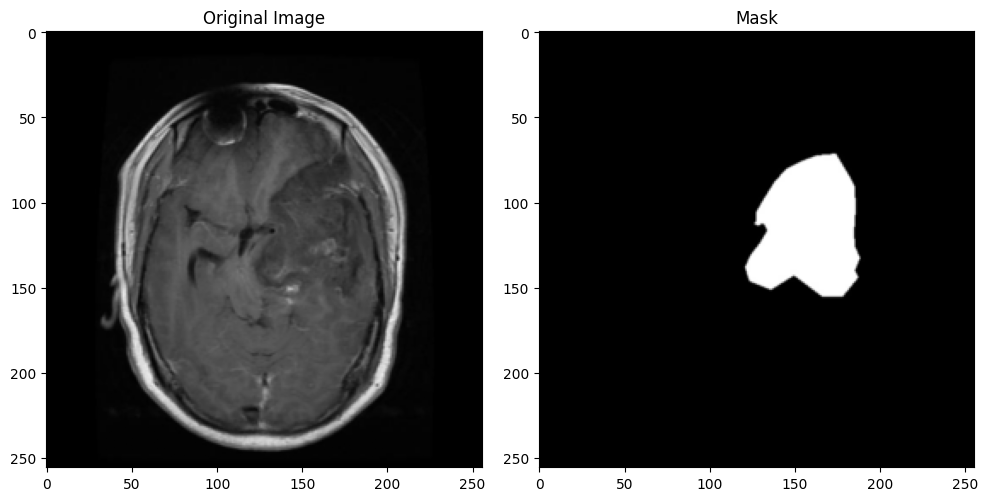

<h1 align="center">CSE428: Deep Learning Project</h1>

  A deep learning project for medical image analysis, built for the course CSE428.

  <a href="#about-the-project">About The Project</a> •
  <a href="#features">Features</a> •
  <a href="#demo">Demo</a> •
  <a href="#installation">Installation</a> •
  <a href="#usage">Usage</a>

---

## About The Project

  This project focuses on **medical image segmentation** using a deep learning model. The goal is to accurately identify and segment specific regions of interest from medical scans. It leverages popular libraries like PyTorch and scikit-image for building, training, and evaluating the model.

### Technologies Used

-   Python
-   PyTorch
-   NumPy & Pandas
-   Scikit-image & Matplotlib
-   Pillow

---

## Features

-   **End-to-end segmentation pipeline:** From data loading to model training and inference.
-   **Model Architecture:** Utilizes a state-of-the-art convolutional neural network (CNN) for precise segmentation.
-   **Comprehensive Evaluation:** Includes scripts to evaluate model performance using metrics like IoU and Dice score.

---

## Demo

  Here is a visual example of the model's output, demonstrating its ability to accurately segment regions from a medical image.
   
  
   
  <em>Original medical image on the left, with the model-generated segmentation mask on the right.</em>

---

## Installation

  To get a local copy up and running, follow these simple steps.

<pre><code>
# Clone the repository
git clone https://github.com/imnaimur/cse428.git

# Navigate to the project directory
cd cse428

# Install dependencies from requirements.txt
pip install -r requirements.txt
</code></pre>

---

## Usage

  This project is designed to be straightforward to use.

### Training

  To train the model on your dataset, use the following command:

<pre><code>
python train.py --epochs 50 --batch_size 16
</code></pre>

### Inference

  To run the trained model on a new image and generate a segmentation mask:

<pre><code>
python predict.py --input_image 'path/to/your/image.png' --output_dir 'path/to/save/results'
</code></pre>
